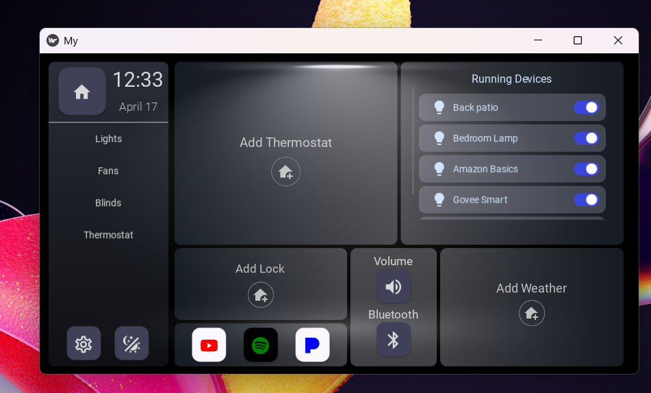
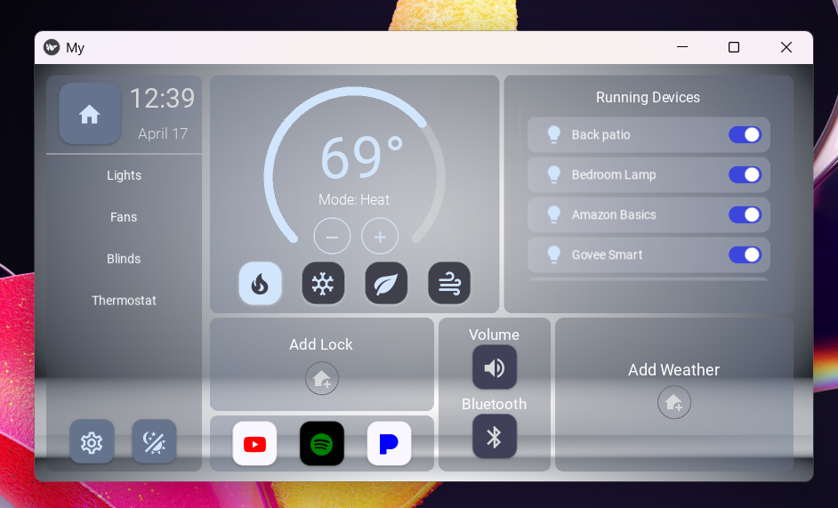
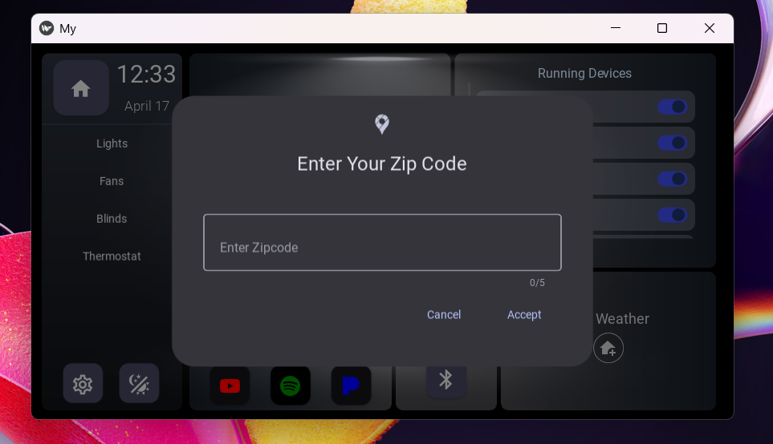
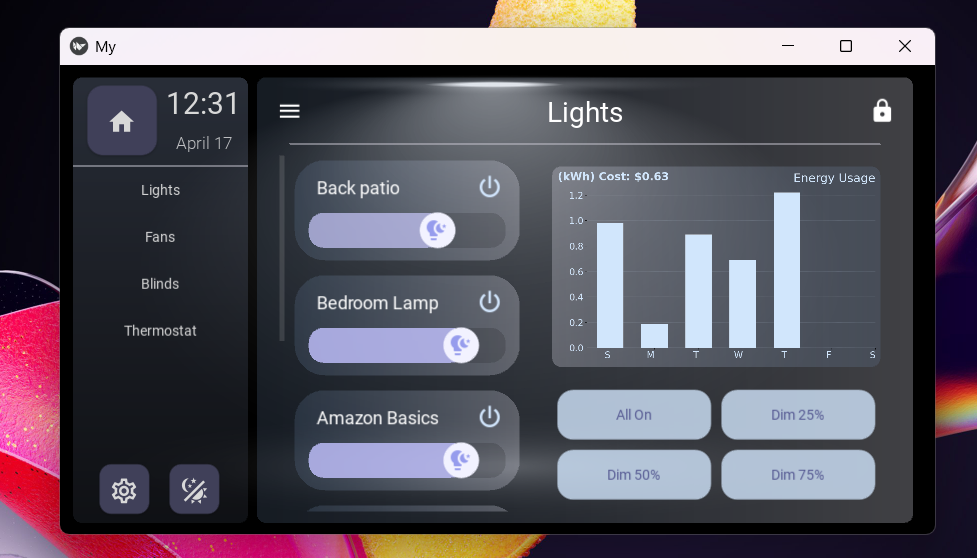

# Kivy Smart Home App

⚠️ This project is under development.

A Python app built with Kivy for controlling lights, fans, blinds, and more in a smart home interface.

## Features

- Custom widgets
- Animated UI
- Smart device states
- Local JSON storage
- ETC.

